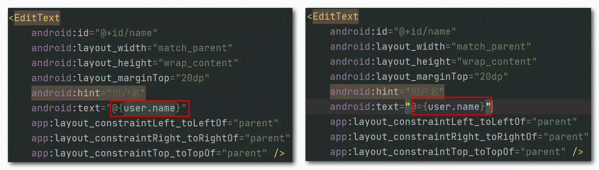

# AndStructTalk
android 架构 总结


apt预编译与Activity没有关系，只跟布局文件里的databinding布局规范有关
关系：MVVM是一种架构；dataBinding是一种辅助工具，可以用到MVP里面MVC里面。


DataBinding会扫描项目中含<Data></Data>标签的布局文件，生成如下文件：
路径：build/intermediates/data_binding_layout_info_type_merge/debug/out/activity_login-layout.xml


根据他生成的文件路径：
build/generated/ap_generated_sources/debug/out/com/jesen/mvvm/databinding/ActivityLoginBindingImpl.java


查看纯净的layout布局文件：
build/intermediates/incremental/mergeDebugResources/stripped.dir/layout/activity_login.xml


假设场景，与MVVM无关，单纯探究DataBinding:
```xml

    <?xml version="1.0" encoding="utf-8"?>
<layout xmlns:android="http://schemas.android.com/apk/res/android"
    xmlns:app="http://schemas.android.com/apk/res-auto"
    xmlns:tools="http://schemas.android.com/tools">

    <data>
        <variable
            name="user"
            type="com.jesen.databinding.model.User" />
    </data>

    <androidx.constraintlayout.widget.ConstraintLayout
        android:layout_width="match_parent"
        android:layout_height="match_parent"
        tools:context=".MainActivity">

        <EditText
            android:id="@+id/name"
            android:layout_width="match_parent"
            android:layout_height="wrap_content"
            android:layout_marginTop="20dp"
            android:hint="用户名"
            android:text="@{user.name}"
            app:layout_constraintLeft_toLeftOf="parent"
            app:layout_constraintRight_toRightOf="parent"
            app:layout_constraintTop_toTopOf="parent" />

        <EditText
            android:id="@+id/pwd"
            android:layout_width="match_parent"
            android:layout_height="wrap_content"
            android:layout_marginTop="20dp"
            android:hint="密码"
            android:text="@{user.pwd}"
            app:layout_constraintLeft_toLeftOf="parent"
            app:layout_constraintRight_toRightOf="parent"
            app:layout_constraintTop_toBottomOf="@id/name" />

    </androidx.constraintlayout.widget.ConstraintLayout>
</layout>
```

定义JavaBean:
```java
 public class User {

    public String name;
    public String pwd;

    public String getName() {
        return name;
    }

    public String getPwd() {
        return pwd;
    }

    public void setName(String name) {
        this.name = name;
    }

    public void setPwd(String pwd) {
        this.pwd = pwd;
    }
}

```
Activity中,通过Model设置View:
```java
  protected void onCreate(Bundle savedInstanceState) {
        super.onCreate(savedInstanceState);
        //setContentView(R.layout.activity_main);
        ActivityMainBinding binding = DataBindingUtil.setContentView(this,R.layout.activity_main);

        // 通过binding改变View
        User user = new User();
        user.setName("卡卡西");
        user.setPwd("123");
        binding.setUser(user);
    }
```
界面可以正常展示：


如果想让界面自动更新，比如5秒后自动更新：
```java

  // 通过binding改变View
        User user = new User();
        user.setName("卡卡西");
        user.setPwd("123");
        binding.setUser(user);

        new Handler().postDelayed(new Runnable() {
            @Override
            public void run() {
                user.setName("卡卡东东");
                user.setPwd("999");
            }
        },5000);
```

发现更新无效...
需要JavaBean继承BaseObservable获得自动更新能力才可以：
```java
 public class User extends BaseObservable {

    public String name;
    public String pwd;

    @Bindable
    public String getName() {
        return name;
    }

    @Bindable
    public String getPwd() {
        return pwd;
    }

    public void setName(String name) {
        this.name = name;
        notifyPropertyChanged(BR.name);
    }

    public void setPwd(String pwd) {
        this.pwd = pwd;
        notifyPropertyChanged(BR.pwd);
    }
}
```

除此之外，支持双向绑定的JavaBean还可以简写为：
```java
  public class User {

    public ObservableField<String> name = new ObservableField<>();
    
    public ObservableField<String> pwd = new ObservableField<>();
}
```

单向绑定是Model层触发影响到View层，双向绑定是View层改变影响到Model层。

在生成的文件ActivityMainBindingImpl.java 用到Handler和Looper循环，用到了new Runnable()创建大量对象